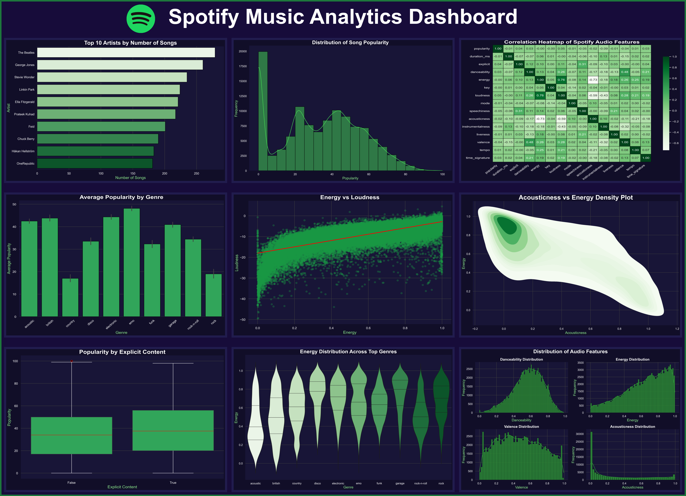

# 🎵 Spotify Music Analytics Dashboard

A comprehensive Exploratory Data Analysis (EDA) project built using **Python**, **Pandas**, **Matplotlib**, and **Seaborn** to analyze over **114,000 Spotify songs**. The project explores song popularity, audio features, artist trends, genre characteristics, and relationships between musical attributes through interactive visualizations and a custom dashboard.

---

## 📊 Dashboard Preview

> 

---

## 📌 Project Objectives

- Analyze Spotify song characteristics
- Explore relationships between audio features
- Identify genre and artist trends
- Understand factors influencing song popularity
- Build a professional dashboard using Matplotlib

---

## 🛠️ Technologies Used

- Python
- Pandas
- NumPy
- Matplotlib
- Seaborn
- Jupyter Notebook

---

## 📁 Project Structure

```
Spotify-Music-Analytics/
│
├── data/
│   ├── spotify-logo.png
│   └── spotify-tracks.csv
│
├── images/
│   ├── correlation_heatmap.png
│   ├── popularity_distribution.png
│   ├── average_popularity_by_genre.png
│   ├── energy_vs_loudness.png
│   ├── acousticness_vs_energy_density_plot.png
│   ├── popularity_by_explicit_content.png
│   ├── energy_distribution_across_top_genres.png
│   ├── distribution_of_audio_features.png
│   └── top_10_artists.png
│
├── dashboard/
│   └── Spotify_Dashboard.png
│
├── notebooks/
│   └── Spotify_dashboard.ipynb
│
├── requirements.txt
└── README.md
```

---

## 📈 Visualizations

The project includes the following analyses:

- Correlation Heatmap of Audio Features
- Distribution of Song Popularity
- Average Popularity by Genre
- Top 10 Artists by Number of Songs
- Energy vs Loudness Regression Analysis
- Acousticness vs Energy Density Plot
- Popularity by Explicit Content
- Energy Distribution Across Genres (Violin Plot)
- Distribution of Key Audio Features

---

## 📊 Key Insights

- Energy and Loudness exhibit a strong positive correlation.
- Acoustic songs generally have lower energy levels.
- Song popularity varies significantly across genres.
- Explicit songs tend to have slightly higher median popularity.
- Most songs cluster around moderate popularity rather than extremely high popularity.
- Different genres exhibit distinct energy distributions.

---

## 🚀 Dashboard

A custom dashboard was developed using **Matplotlib**, combining multiple visualizations into a Spotify-inspired interface.

Features include:

- Dark Spotify-themed design
- High-resolution dashboard export
- Consistent styling across all visualizations
- Portfolio-ready presentation

---

## ▶️ Installation

Clone the repository

```bash
git clone https://github.com/yourusername/Spotify-Music-Analytics.git
```

Install dependencies

```bash
pip install -r requirements.txt
```

Run the notebook or dashboard script.

---

## 📚 Dataset

Spotify Songs Dataset (Kaggle)

---

## 👨‍💻 Author

**Abdullah Ayub**

If you found this project interesting, feel free to ⭐ the repository.